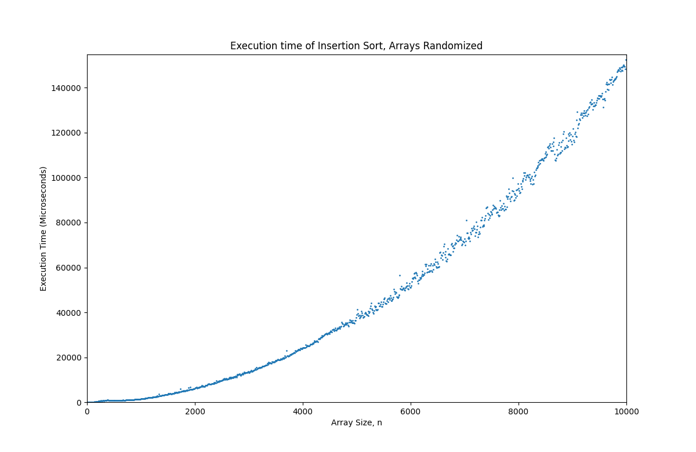

Sorting Benchmarking
====================

This project was made to benchmark various sorting algorithms and test their execution speeds given various sized input arrays. 

Usage
-----
The utility can be combiled using the following command.

`g++ -std=c++11 -o SortingBenchmark.out src/*.cpp src/*.h -I/usr/include/python3.6 -lpython3.6m`


Run the utility and follow the instructions provided. An example walkthrough is below.

```
Which sorting algorithms would you like to test?
 1. Selection Sort
 2. Bubble Sort
 3. Insertion Sort
 4. Shell Short (gap = 2.2)
 5. Merge Sort
 6. Quick Sort
 7. Heap Sort
 8. Radix Sort
 9. Bucket Sort
10. Pancake Sort
11. Exit the Utility
> 3
What type of array should be tested?
1. Randomized
2. Ascending Order (Sorted Order)
3. Descending Order (Reverse Order)
> 1
What range of array sizes should be tested? Enter a lower bound, upper bound, and an interval separated by spaces. Example: 10 1000 10
> 10 10000 10
How many trials should be done for each size?
> 1
[100%]
Would you like to save the plot? (Y/N)
> Y
Enter a file name. Do not include a file extension.
> Insertion10k
Plot exported to Insertion10k.png
```
**Result:**


Dependencies
------------
This utility uses [matplotlib-cpp](https://github.com/lava/matplotlib-cpp). A working Python installation with matplotlib and NumPy is required. The SortingBenchmarking utility was tested using C++14 with the CMake build system and Python 3.6 on Ubuntu 18.04.5 LTS.
